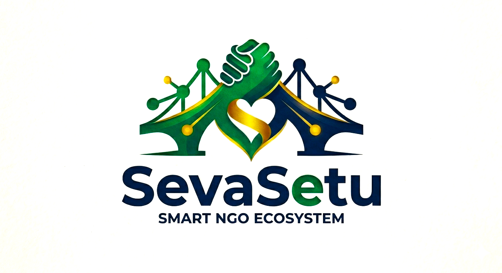

<p align="center">
  
</p>

<p align="center">
  <strong>Bridging Helping Hands to Hopeful Hearts.</strong>
</p>

<p align="center">
  
  
  
  
  
  
</p>

---

**SevaSetu** is a full-stack community coordination platform powered by Flask, Firebase, and Gemini AI. It eliminates the manual overhead of NGO volunteer coordination — field reports become structured needs in seconds, and AI finds the right volunteer automatically.

> *No more paper surveys. No more WhatsApp chains. Just the right person, in the right place, at the right time.*

---

## 📖 Table of Contents

- [Features](#-features)
- [Tech Stack](#-tech-stack)
- [Architecture Overview](#-architecture-overview)
- [How It Works](#-how-it-works)
- [Project Structure](#️-project-structure)
- [AI Systems](#-ai-systems)
- [Async Architecture](#-async-architecture-qstash)
- [Real-time Systems](#-real-time-systems)
- [Installation & Setup](#-installation--setup)
- [Environment Variables](#-environment-variables)
- [User Roles](#-user-roles)
- [Contributing](#-contributing)

---

## 🚀 Features

### 🧠 AI-Powered Core

| Feature | Description |
|---------|-------------|
| **Field Report Extraction** | Upload PDF, image, or DOCX — Gemini 2.5 Flash extracts title, description, urgency score (1–10), category, required skills, location, beneficiaries, and deadline suggestion |
| **AI Volunteer Matching** | Two-stage pipeline: geo filter → keyword pre-sort → Gemini batch-scores all candidates (0–100) with confidence labels, one-sentence reasoning, strengths, and concerns |
| **Location Intelligence** | AI-extracted location strings are forward-geocoded server-side via OlaMaps Text Search into structured `{ city, lat, lng }` objects |

### 🗺️ Maps & Location

| Feature | Description |
|---------|-------------|
| **Needs Heatmap** | OlaMaps dashboard mini-map + expandable full modal with urgency-colored pins for all posted needs |
| **Interactive Location Picker** | Draggable marker + click-to-place on NGO onboarding, volunteer onboarding, and manual need creation |
| **Reverse Geocoding** | Pin drop auto-fills city/address fields via OlaMaps reverse geocode API |

### 🔔 Notifications & Messaging

| Feature | Description |
|---------|-------------|
| **FCM Push Notifications** | Background push via Service Worker for match suggestions, assignments, completion reports, and chat messages |
| **In-Context Chat** | Socket.IO real-time messaging linked to specific needs; polling transport for Vercel serverless compatibility |
| **Foreground Toasts** | In-app notification toasts when the app is open, deduped to avoid spam |

### ✅ Task Lifecycle

| Feature | Description |
|---------|-------------|
| **Full Status Flow** | Open → Assigned → In Progress → In Review → Completed |
| **Completion Reports** | Volunteers submit work description, impact summary, hours, and photo proof |
| **NGO Review Workflow** | NGO approves or requests changes; approval triggers volunteer stat update |
| **Volunteer Unassign** | NGO can unassign a volunteer, resetting the need to Open and re-triggering AI matching |

### 🛡️ Admin Panel

| Feature | Description |
|---------|-------------|
| **NGO Verification Queue** | Review, approve, or suspend NGOs with one-click actions |
| **Platform Stats** | Total NGOs, volunteers, open/resolved needs, urgent needs |
| **Activity Feed** | Cross-platform events aggregated from all NGO activity subcollections |
| **Category Chart** | Chart.js donut + bar chart switching for needs category breakdown |
| **Manual NGO Registration** | Admin can register NGOs directly with full profile + Firebase Auth user creation |

### 🔄 Async & Reliability

| Feature | Description |
|---------|-------------|
| **QStash Job Queue** | Upload endpoint returns instantly; Gemini extraction and matching run as background HTTP jobs |
| **Automatic Retry** | QStash retries on 5xx — Gemini quota errors (429 → 500) are retried automatically with backoff |
| **Polling Status Page** | Animated processing page polls `/api/ngo/report/<id>/status` every 3 seconds until Gemini finishes |

---

## 🧩 Tech Stack

| Layer | Technology | Purpose |
|-------|------------|---------|
| **Frontend** | HTML, CSS, Vanilla JS | All UI pages |
| **CSS Framework** | Tailwind CSS (CDN) | Utility-first styling |
| **Backend** | Flask 3.x + Flask-SocketIO | API routes + real-time chat |
| **Database** | Firebase Firestore | All persistent data |
| **Authentication** | Firebase Auth | Google OAuth + Email/Password |
| **File Storage** | ImageKit | Reports, logos, avatars, proof photos |
| **Maps** | OlaMaps Web SDK | Location picker, heatmap, geocoding |
| **AI — Extraction** | Gemini 2.5 Flash (`gemini-2.5-flash`) | Need extraction from field reports |
| **AI — Matching** | Gemini 2.5 Flash | Holistic volunteer scoring |
| **AI SDK** | `google-genai` | Official Google GenAI Python SDK |
| **Job Queue** | Upstash QStash | Async background jobs |
| **Real-time** | Flask-SocketIO (polling) | Chat + typing indicators |
| **Push Notifications** | Firebase Cloud Messaging | Background + foreground push |
| **Charts** | Chart.js | Admin dashboard visualizations |
| **Hosting** | Vercel (serverless) / Render | Deployment |

---

## 🏗️ Architecture Overview

```
┌─────────────────────────────────────────────────────────────┐
│                        CLIENT BROWSER                        │
│  NGO Dashboard  │  Volunteer Dashboard  │  Admin Dashboard  │
└────────┬────────┴──────────┬────────────┴────────┬──────────┘
         │  HTTP / Socket.IO │                     │
┌────────▼───────────────────▼─────────────────────▼──────────┐
│                      FLASK APPLICATION                        │
│  Routes  │  Auth middleware  │  SocketIO events  │  APIs     │
└────┬─────┴──────────┬────────┴──────────┬─────────┴──────────┘
     │                │                    │
     ▼                ▼                    ▼
┌─────────┐    ┌─────────────┐    ┌───────────────┐
│Firestore│    │  QStash     │    │  ImageKit CDN │
│(data)   │    │  Job Queue  │    │  (files)      │
└─────────┘    └──────┬──────┘    └───────────────┘
                      │
          ┌───────────┴──────────┐
          ▼                      ▼
  ┌──────────────┐      ┌──────────────────┐
  │Gemini 2.5    │      │  Matching Engine │
  │Flash         │      │  (geo + Gemini)  │
  │(extraction)  │      └────────┬─────────┘
  └──────────────┘               │
                                 ▼
                         ┌──────────────┐
                         │ FCM (push    │
                         │ notifications│
                         └──────────────┘
```

---

## 🧠 How It Works

### NGO Flow

1. **Register & Onboard** — set org name, description, contact, and pin HQ on OlaMaps
2. **Upload Field Report** — PDF/image/DOCX uploaded to ImageKit; QStash enqueues extraction job
3. **AI Extracts Needs** — Gemini 2.5 Flash reads the report and returns structured need objects; OlaMaps geocodes location strings server-side
4. **Review & Edit** — NGO reviews extracted needs on an edit screen (adjust urgency, skills, location) with live geocoding feedback
5. **Publish** — needs go live on the map; QStash enqueues matching job per need
6. **Review Matches** — AI-scored volunteer suggestions appear on dashboard with confidence, reasoning, strengths, concerns
7. **Approve Match** — NGO approves a volunteer; volunteer gets FCM notification
8. **Chat** — NGO and volunteer communicate via real-time inbox linked to the need
9. **Review Completion** — volunteer submits report with photo; NGO approves or requests changes

### Volunteer Flow

1. **Register & Onboard** — select skills, availability, service radius; pin location on OlaMaps
2. **Receive Match** — FCM notification when AI matches volunteer to a need (works even when app is closed)
3. **Accept Task** — task moves to Assigned; NGO notified
4. **Complete Task** — submit hours, description, impact summary, and photo proof
5. **Await Approval** — task enters In Review; completed on NGO approval

---

## ⚙️ Project Structure

```
sevasetu/
│
├── app.py                             # Flask application — all routes and SocketIO events
├── requirements.txt
├── vercel.json                        # Serverless rewrite config
│
├── templates/
│   ├── base.html                      # Shared nav + footer layout
│   ├── home.html                      # Public landing page
│   ├── login.html                     # Firebase Auth (Google + Email)
│   ├── roleselection.html             # NGO vs Volunteer picker
│   ├── inbox.html                     # Real-time Socket.IO chat inbox
│   │
│   ├── ngo_dashboard.html             # Stats, matches, heatmap, upload/manual modals
│   ├── ngo_onboarding.html            # OlaMaps picker + org profile form
│   ├── ngo_needs_list.html            # Needs list with filters + manual create modal
│   ├── ngo_field_reports.html         # Field reports list + upload trigger
│   ├── ngo_upload_processing.html     # Animated polling page (Gemini in progress)
│   ├── ngo_review_needs.html          # Edit AI-extracted needs before publishing
│   ├── ngo_review_report.html         # NGO reviews volunteer completion report
│   ├── ngo&volunteerdetails.html      # Need detail (shared view, role-aware actions)
│   │
│   ├── volunteer_dashboard.html       # Tasks, stats, mini-map, accepted tasks
│   ├── volunteer_onboarding.html      # Skills chips, radius slider, OlaMaps picker
│   ├── volunteer_complete.html        # Completion form + photo upload
│   ├── completion-success-state.html  # Post-submission success screen
│   │
│   ├── admin_dashboard.html           # Platform stats, Chart.js, verification queue
│   ├── ngo-management.html            # NGO table + sidebar + verify/suspend
│   └── volunteer-management.html      # Volunteer cards + sidebar + approve/suspend
│
├── static/
│   ├── css/                           # Per-page stylesheets
│   ├── js/
│   │   ├── admin_dashboard.js         # Stats, chart tabs, NGO table, verification
│   │   ├── auth.js                    # Firebase Auth (Google popup + Email forms)
│   │   ├── inbox.js                   # Socket.IO chat, conversation list, history
│   │   ├── login.js                   # Sign in / sign up tab switcher
│   │   ├── ngo_dashboard.js           # Upload modal, manual modal, heatmap, matches
│   │   ├── ngo_needs_list.js          # Filters, delete, manual create, OlaMaps modal
│   │   ├── ngo_onboarding.js          # OlaMaps picker + form validation + progress
│   │   ├── ngo-management.js          # Admin NGO table, pagination, verify workflow
│   │   ├── ngo&volunteerdetails.js    # Need detail: accept, chat, unassign actions
│   │   ├── roleselection.js           # Role picker form submit
│   │   ├── script.js                  # Global: toast, skeleton, online toggle
│   │   ├── task_completion.js         # Completion form + photo preview + submit
│   │   ├── topbar.js                  # FCM token, foreground toasts, lazy avatar
│   │   ├── volunteer_dashboard.js     # Tasks, accept/decline, OlaMaps mini+full map
│   │   ├── volunteer_onboarding.js    # Skills, slider, OlaMaps picker, draft save
│   │   └── volunteer-management.js   # Admin volunteer cards, filters, approve
│   │
│   ├── firebase-messaging-sw.js       # FCM Service Worker (background push handler)
│   └── images/
│
└── services/
    ├── firebase_services.py           # All Firestore CRUD, chat, match, activity helpers
    ├── gemini_service.py              # Gemini 2.5 Flash need extraction + JSON parsing
    ├── matching_service.py            # AI-first matching: geo filter → presort → Gemini
    ├── geocoding_service.py           # OlaMaps forward geocoding for AI location strings
    ├── imagekit_services.py           # Upload reports, logos, avatars, proof photos
    ├── notification_service.py        # FCM multicast push to all user tokens
    ├── qstash_service.py              # Upstash QStash job publishing
    └── overview.py                    # Firestore schema reference (dev docs)
```

---

## 🤖 AI Systems

### Need Extraction (`gemini_service.py`)

- **Model**: `gemini-2.5-flash` via `google-genai` SDK
- **Input**: Public ImageKit URL of the uploaded report (PDF, JPG, PNG, DOCX)
- **Output**: JSON array of need objects with `title`, `description`, `category`, `urgency_score` (1–10), `urgency_label`, `required_skills`, `location`, `beneficiaries`, `estimated_people`, `deadline_suggestion`
- **Thinking**: Budget of 2048 tokens for complex inference
- **Error handling**: 429/500 errors propagate up — QStash retries automatically

### Volunteer Matching (`matching_service.py`)

The engine is AI-first. Gemini acts as the judge, not a re-ranker.

```
Online Volunteers (Firestore query)
         ↓
[1] Hard Geo Filter
    Only rule: volunteer.radius must reach need.location
    Volunteers with unknown location are kept (AI will factor it in)
         ↓
[2] Keyword Pre-sort (trim to ~25 candidates)
    Token overlap between need text and volunteer skills+bio
    No weights, no tuning — just a cheap gate before the LLM call
         ↓
[3] Gemini Batch Evaluation (ONE API call)
    Gemini receives full need context + all volunteer profiles
    Returns per candidate:
      • score (0–100)
      • confidence (HIGH / MEDIUM / LOW)
      • reason (≤20 words)
      • strengths (up to 3 bullet points)
      • concerns (up to 3 bullet points)
         ↓
[4] Filter (score > 10) + Top N written to Firestore
         ↓
[5] FCM notifications sent to matched volunteers
    NGO activity log updated
```

**What Gemini evaluates holistically:**
- Skill inference from bio text (not just tags)
- Urgency alignment with availability
- Proximity for physical vs. remote tasks
- Reliability signals (verified, rating, tasks done)
- Real-world capability inferred from self-description

**Fallback**: If Gemini is unavailable, normalized keyword scores (0–70) are used so matching never breaks.

---

## 🔄 Async Architecture (QStash)

The upload flow is fully non-blocking. The user gets a redirect instantly; Gemini runs in the background.

| Worker Endpoint | Trigger | Action |
|----------------|---------|--------|
| `POST /api/internal/process-report` | NGO uploads report | Runs Gemini extraction, saves draft needs, updates report status |
| `POST /api/internal/run-matching` | Need published | Runs full matching pipeline, writes match docs, sends FCM |

Both endpoints are authenticated with a shared `X-QStash-Secret` header. QStash retries on 5xx with exponential backoff — Gemini rate limit errors (HTTP 429 → worker returns 500) are automatically retried.

---

## 💬 Real-time Systems

### Chat (Socket.IO)
- Forced to **polling transport** — WebSockets are not supported on Vercel serverless
- Messages stored in `conversations/{id}/messages` Firestore subcollection
- REST fallback (`POST /api/chat/send`) if Socket.IO connection drops
- Typing indicators broadcast to all room members except the sender
- FCM notification sent to other participants on every message

### Push Notifications (FCM)
- Tokens registered per-device via `topbar.js` on first interaction
- `MulticastMessage` sent to all registered tokens for a user
- Invalid/expired tokens auto-removed after send
- Service Worker (`firebase-messaging-sw.js`) handles background push
- Foreground push intercepted by `onMessage` handler → in-app toast

---

## 🪜 Installation & Setup

### Prerequisites
- Python 3.11+
- Firebase project with Firestore, Auth (Google + Email), and Cloud Messaging enabled
- Upstash account (QStash)
- OlaMaps developer account
- ImageKit account
- Google AI Studio account (Gemini API key)

### Steps

```bash
# 1. Clone
git clone https://github.com/yourusername/sevasetu.git
cd sevasetu

# 2. Virtual environment
python -m venv venv
source venv/bin/activate        # Mac/Linux
venv\Scripts\activate           # Windows

# 3. Dependencies
pip install -r requirements.txt

# 4. Environment
cp .env.example .env
# fill in all values

# 5. Run
python app.py
# → http://127.0.0.1:5000
```

---

## 🔑 Environment Variables

```bash
# Flask
SECRET_KEY=

# Firebase (service account as JSON string)
FIREBASE_CONFIG=

# Firebase Web SDK
FIREBASE_API_KEY=
FIREBASE_AUTH_DOMAIN=
FIREBASE_PROJECT_ID=
FIREBASE_STORAGE_BUCKET=
FIREBASE_MESSAGING_SENDER_ID=
FIREBASE_APP_ID=
FIREBASE_VAPID_KEY=

# Gemini AI
GEMINI_API_KEY=

# OlaMaps
OLA_MAPS_API_KEY=

# ImageKit
IMAGEKIT_PRIVATE_KEY=
IMAGEKIT_PUBLIC_KEY=
IMAGEKIT_URL_ENDPOINT=

# Upstash QStash
QSTASH_TOKEN=
QSTASH_SECRET=
APP_BASE_URL=
```

---

## 👥 User Roles

| Role | Capabilities |
|------|-------------|
| **NGO Coordinator** | Upload reports, review AI needs, post manually, manage matches, chat with volunteers, review completion reports, view heatmap |
| **Volunteer** | View matched tasks, accept/decline, submit completion reports with photo proof, chat with NGOs |
| **Admin** | Verify/suspend NGOs, approve/suspend volunteers, platform-wide stats and activity, manual NGO registration |

---

## 🗺️ OlaMaps Integration Points

| Context | Usage |
|---------|-------|
| NGO Onboarding | Interactive map + draggable marker, reverse geocoding fills city/address |
| Volunteer Onboarding | Map picker for base location used in radius matching |
| Manual Need Creation | Optional map pin inside the create-need modal |
| NGO Dashboard Heatmap | Read-only urgency-colored pin map (mini + full modal) |
| Server-side Geocoding | `geocoding_service.py` converts AI-extracted strings to `{ city, lat, lng }` |

---

## 🤝 Contributing

Pull requests are welcome. For major changes, please open an issue first to discuss.

1. Fork the repo
2. Create a feature branch (`git checkout -b feature/your-feature`)
3. Commit your changes
4. Push to the branch
5. Open a Pull Request

---

## 📜 License

This project is open-source under the [MIT License](LICENSE).

---

<p align="center">
  <em>"Skill deserves direction. SevaSetu points it where it matters most."</em>
</p>
